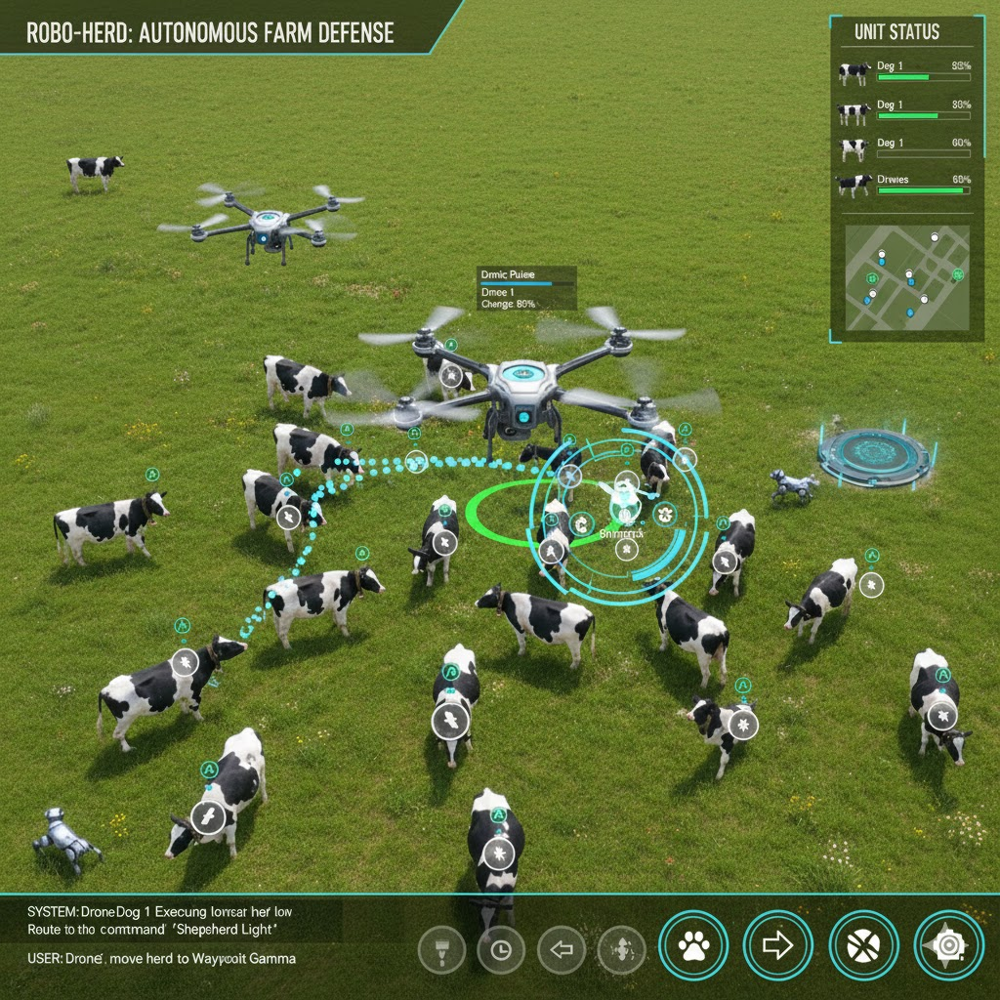

# Cow Tracker



## Overview

ESP32 firmware for real-time cow tracking and monitoring as part of the Moo-ve-It smart farm system. This firmware collects location data from air tag modules and transmits it to Sentry.io for processing by the backend, enabling autonomous herd management through robotic control.

## Features

- **Smart WiFi Connection** - Automatically connects to strongest available network from configured list
- **NTP Time Sync** - Synchronizes with internet time servers for accurate timestamps
- **Air Tag Integration** - Reads location data from air tag modules for real-time cow positioning
- **Sentry.io Telemetry** - Sends structured JSON events to Sentry.io at regular intervals
- **Sensor Data Collection** - Monitors battery level and optional environmental data
- **Low Power Design** - Optimized for battery-powered operation on livestock
- **Network Resilience** - Automatic reconnection handling for WiFi disruptions
- **Configurable Reporting** - Adjustable transmission intervals

## Getting Started

### Prerequisites

- Arduino IDE (1.8.x+) or PlatformIO
- ESP32 board support package
- Required libraries:
  - WiFi (built-in)
  - HTTPClient (built-in)
  - ArduinoJson (6.x+)
  - Sentry SDK for Arduino (if available) or custom HTTP implementation

### Installation

1. Clone the repository:
   ```bash
   git clone https://github.com/Moo-ve-It/Cow-Tracker.git
   cd Cow-Tracker
   ```

2. Configure settings:
   ```bash
   cd SmartWiFiConnect
   cp config.h.example config.h
   # Edit config.h with your WiFi networks, Sentry credentials, and device settings
   ```

4. Test WiFi connectivity:
   - Upload `WiFiScanner/WiFiScanner.ino` to verify networks are visible
   - Upload `SmartWiFiConnect/SmartWiFiConnect.ino` to test automatic connection and Sentry API

5. Run the cow tracker simulator:
   - Copy `config.h` from SmartWiFiConnect to CowTracker directory
   - Edit `config.h` with your Sentry DSN values:
     - Get DSN from Sentry → Settings → Projects → Client Keys (DSN)
     - From DSN `https://PUBLIC_KEY@HOST/PROJECT_ID`
     - Set `SENTRY_PROJECT` to the PROJECT_ID (last number in DSN)
     - Set `SENTRY_AUTH_TOKEN` to the PUBLIC_KEY (hex string before @)
   - Upload `CowTracker/CowTracker.ino` to simulate 30 cows sending data every 5-10 minutes

6. Flash to ESP32:
   - Open the project in Arduino IDE or PlatformIO
   - Select your ESP32 board
   - Upload the firmware

## Configuration

Edit `SmartWiFiConnect/config.h` to configure:

```cpp
// WiFi Networks
const char* networks[][2] = {
  {"Network1", "password1"},
  {"Network2", "password2"}
};

// Sentry.io
const char* SENTRY_ORG = "your-org-slug";
const char* SENTRY_PROJECT = "your-project-slug";
const char* SENTRY_AUTH_TOKEN = "your-auth-token";

// Device
const char* DEVICE_ID = "cow-001";
const int REPORT_INTERVAL = 30000;  // milliseconds
```

## Data Format

The firmware sends JSON payloads to Sentry.io:

```json
{
  "device_id": "cow-001",
  "timestamp": 1700000000,
  "location": {
    "tag_id": "tag-abc123",
    "x": 45.2,
    "y": 78.5
  },
  "battery_level": 87,
  "temperature": 22.5
}
```

## Contributing

1. Fork the repository
2. Create a feature branch (`git checkout -b feature/improvement`)
3. Commit your changes (`git commit -am 'Add new feature'`)
4. Push to the branch (`git push origin feature/improvement`)
5. Open a Pull Request

## License

MIT License

## Acknowledgments

Developed by the Moo-ve-It team for the hackathon. Special thanks to our sponsors:
- Daytona
- Sentry
- Code Rabbit
- BrowserStack
- Galileo

---

Part of the [Moo-ve-It](https://github.com/Moo-ve-It) smart farm ecosystem.
